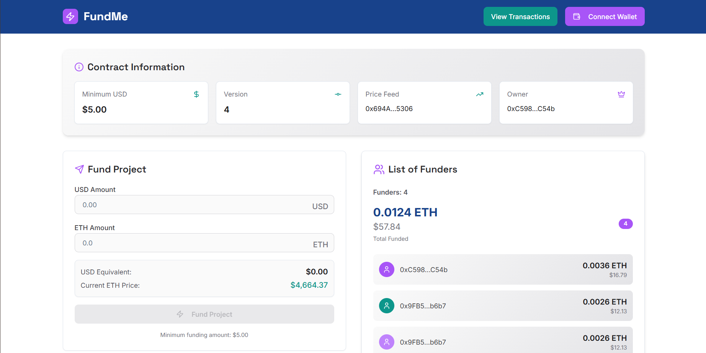
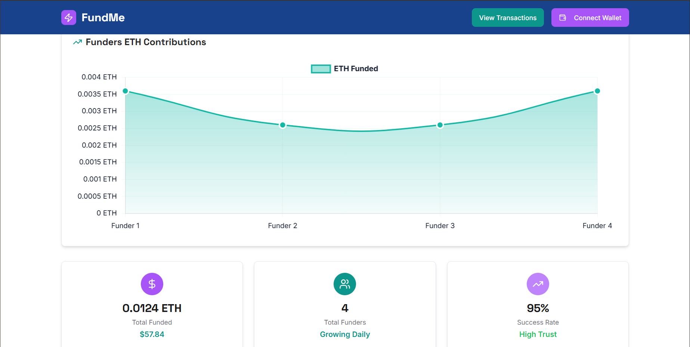

# FundMe - Decentralized Funding Platform

[](https://opensource.org/licenses/MIT)
[](https://www.typescriptlang.org/)
[](https://reactjs.org/)
[](https://vitejs.dev/)
[](https://tailwindcss.com/)

[🛠 Foundry FundMe Smart Contract](https://github.com/John-Mukhwana/solidity-foundry-fund-me.git) | [🌐 Live Demo](https://your-deployed-url.com) | [📖 Documentation](https://docs.yourproject.com)

FundMe is a modern, decentralized funding platform that empowers creators and innovators to receive funding directly from supporters through blockchain technology. Built on the Base mainnet, it provides a secure, transparent, and user-friendly way to fund projects without intermediaries.

## 📸 Screenshots

### Main Dashboard


### Funding Interface


## ✨ Features

- **🔗 Wallet Integration**: Seamless connection with Ethereum wallets using Reown AppKit
- **📊 Real-time Analytics**: View contract statistics, funding progress, and contributor data
- **💰 Secure Funding**: Fund projects with ETH, tracked on the blockchain
- **👥 Contributor Tracking**: Monitor your funding history and contributions
- **👑 Owner Dashboard**: Project owners can manage funds and view detailed analytics
- **📱 Responsive Design**: Beautiful, mobile-first UI with dark/light mode support
- **📈 Interactive Charts**: Visualize funding data with Chart.js and Recharts
- **🔒 Smart Contract Integration**: Direct interaction with audited smart contracts

## 🛠 Tech Stack

### Frontend
- **React 18** - Modern UI library with hooks
- **TypeScript** - Type-safe JavaScript
- **Vite** - Fast build tool and dev server
- **Tailwind CSS** - Utility-first CSS framework

### Blockchain Integration
- **wagmi** - React hooks for Ethereum
- **viem** - Low-level Ethereum library
- **Reown AppKit** - Wallet connection modal

### UI/UX
- **shadcn/ui** - High-quality React components
- **Framer Motion** - Animation library
- **Chart.js & Recharts** - Data visualization

### Development Tools
- **ESLint** - Code linting
- **Prettier** - Code formatting
- **PostCSS** - CSS processing

## 📋 Prerequisites

Before you begin, ensure you have the following installed:

- **Node.js** (v18 or higher) - [Download here](https://nodejs.org/)
- **pnpm** (v8 or higher) - [Install guide](https://pnpm.io/installation)
- **Git** - [Download here](https://git-scm.com/)
- **Ethereum Wallet** (MetaMask, Coinbase Wallet, etc.)

## 🚀 Quick Start

1. **Clone the repository**
   ```bash
   git clone https://github.com/John-Mukhwana/Foundry-FundMe-Reactjs-Typescript.git
   cd Foundry-FundMe-Reactjs-Typescript
   ```

2. **Install dependencies**
   ```bash
   pnpm install
   ```

3. **Set up environment variables**
   ```bash
   cp .env.example .env
   # Edit .env with your API keys
   ```

4. **Start development server**
   ```bash
   pnpm run dev
   ```

5. **Open your browser**
   Navigate to [http://localhost:5173](http://localhost:5173)

## 📦 Installation

### Using pnpm (Recommended)

```bash
# Install dependencies
pnpm install

# Start development server
pnpm run dev

# Build for production
pnpm run build

# Preview production build
pnpm run preview
```

### Using npm

```bash
# Install dependencies
npm install

# Start development server
npm run dev

# Build for production
npm run build

# Preview production build
npm run preview
```

## 🔧 Configuration

### Environment Variables

Create a `.env` file in the root directory with the following variables:

```env
# Required: Your Alchemy API key for Base network access
VITE_ALCHEMY_KEY=your_alchemy_api_key_here

# Required: Reown AppKit project ID for wallet connections
VITE_REOWN_PROJECT_ID=your_reown_project_id_here

# Required: Base mainnet RPC endpoint
VITE_BASE_RPC_URL=https://mainnet.base.org
```

### Getting API Keys

1. **Alchemy API Key**:
   - Visit [Alchemy](https://www.alchemy.com/)
   - Create a free account
   - Generate an API key for Base network

2. **Reown Project ID**:
   - Visit [Reown Cloud](https://cloud.reown.com/)
   - Create a new project
   - Copy the Project ID

## 📁 Project Structure

```
fundme-reactjs/
├── public/                 # Static assets
├── src/
│   ├── components/         # Reusable UI components
│   │   ├── ui/            # shadcn/ui components
│   │   └── ...            # Feature components
│   ├── hooks/             # Custom React hooks
│   ├── lib/               # Utility libraries
│   ├── pages/             # Page components
│   ├── utils/             # Helper functions
│   └── ...
├── .env.example           # Environment variables template
├── package.json           # Dependencies and scripts
├── tailwind.config.ts     # Tailwind CSS configuration
├── tsconfig.json          # TypeScript configuration
└── vite.config.ts         # Vite configuration
```

## 🏗 Development

### Available Scripts

- `pnpm run dev` - Start development server
- `pnpm run build` - Build for production
- `pnpm run preview` - Preview production build
- `pnpm run lint` - Run ESLint

### Code Style

This project uses ESLint and Prettier for code quality. Run `pnpm run lint` to check for issues.

### Smart Contract Integration

The frontend interacts with the FundMe smart contract deployed on Base mainnet. Contract details:

- **Address**: `0x5C6B1d462742AA58288F601E4722Df232682442b`
- **Network**: Base Mainnet (Chain ID: 8453)
- **Source**: [GitHub Repository](https://github.com/John-Mukhwana/solidity-foundry-fund-me.git)

## 🚀 Deployment

### Build for Production

```bash
# Build the application
pnpm run build

# The build artifacts will be stored in the `dist/` directory
```

### Deploy to Vercel

1. Connect your GitHub repository to [Vercel](https://vercel.com/)
2. Add environment variables in Vercel dashboard
3. Deploy automatically on push to main branch

### Deploy to Netlify

1. Connect your GitHub repository to [Netlify](https://netlify.com/)
2. Set build command: `pnpm run build`
3. Set publish directory: `dist`
4. Add environment variables
5. Deploy

## 🤝 Contributing

We welcome contributions! Please see our [Contributing Guide](CONTRIBUTING.md) for details.

### How to Contribute

1. Fork the repository
2. Create a feature branch: `git checkout -b feature/your-feature-name`
3. Make your changes and commit: `git commit -m 'Add some feature'`
4. Push to the branch: `git push origin feature/your-feature-name`
5. Open a Pull Request

### Development Guidelines

- Follow the existing code style
- Write clear, concise commit messages
- Add tests for new features
- Update documentation as needed
- Ensure all tests pass before submitting PR

## 📄 License

This project is licensed under the MIT License - see the [LICENSE](LICENSE) file for details.

## 🙋‍♂️ Support

If you have any questions or need help:

- 📧 **Email**: your-email@example.com
- 💬 **Discord**: [Join our community](https://discord.gg/your-invite)
- 🐛 **Issues**: [GitHub Issues](https://github.com/John-Mukhwana/Foundry-FundMe-Reactjs-Typescript/issues)
- 📖 **Documentation**: [Full Docs](https://docs.yourproject.com)

## 🙏 Acknowledgments

- [Coinbase Base](https://base.org/) for the excellent Layer 2 network
- [Reown](https://reown.com/) for wallet integration tools
- [shadcn/ui](https://ui.shadcn.com/) for beautiful UI components
- The Ethereum community for inspiration and tools

---

**Built with ❤️ by [CypherPulse.base.eth](https://github.com/John-Mukhwana)**

*Fund the future, one block at a time.* 🚀
